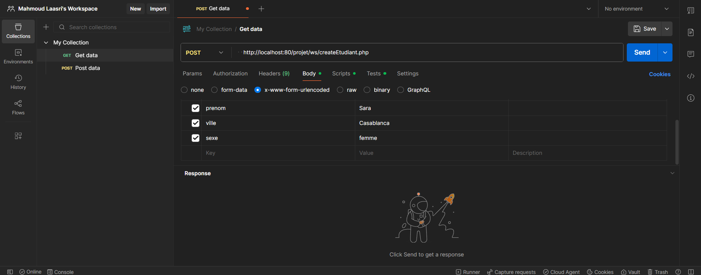
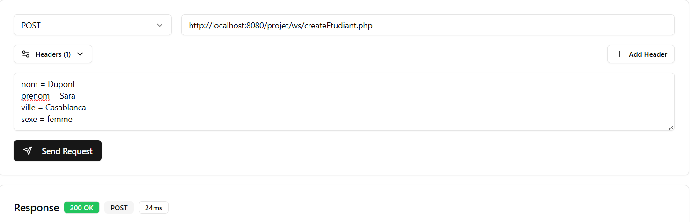
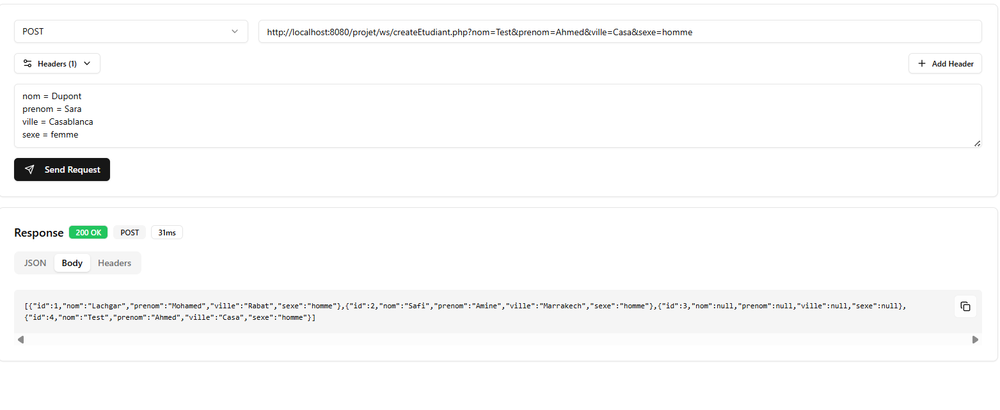
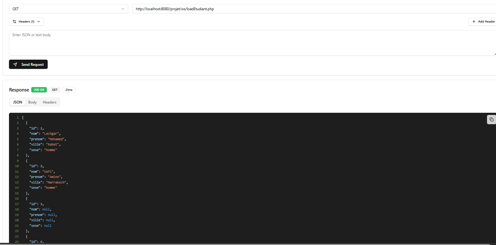
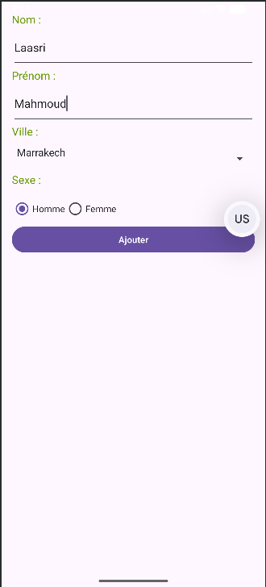
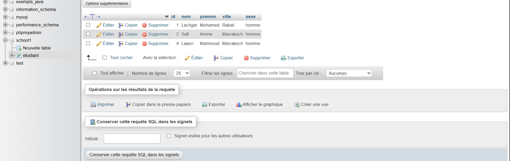

Ce projet consiste à développer un Web Service en PHP permettant de gérer une liste d’étudiants stockée dans une base de données MySQL, puis de consommer ce service via Postman et une application mobile.

Le projet commence par la création d’une base de données nommée "school1" dans phpMyAdmin. À l’intérieur de cette base, une table appelée "etudiant" est créée avec les champs suivants : id (clé primaire auto-incrémentée), nom, prenom, ville et sexe.

Affichage de la table etudiant dans phpMyAdmin avec les premiers enregistrements (Lachgar Mohamed, Safi Amine).
Cette capture montre que la base de données fonctionne correctement et que les données sont bien stockées.

Ensuite, un Web Service est développé en PHP dans le dossier :

http://localhost:8080/projet/ws/

Deux fichiers principaux sont utilisés :

createEtudiant.php : permet d’ajouter un étudiant dans la base de données.

loadEtudiant.php : permet de récupérer la liste des étudiants au format JSON.

Pour tester l’ajout d’un étudiant, nous utilisons Postman.

Configuration de la requête POST dans Postman vers createEtudiant.php.
La méthode utilisée est POST avec le type x-www-form-urlencoded.
Les paramètres envoyés sont :
nom = Dupont
prenom = Sara
ville = Casablanca
sexe = femme

Après l’envoi de la requête, le serveur répond avec un code 200 OK.

 
Réponse JSON retournée après l’insertion.
La réponse contient la liste complète des étudiants sous format JSON.

Une autre méthode de test est utilisée en passant les paramètres directement dans l’URL.

Requête POST avec paramètres dans l’URL (query parameters).
Exemple :
http://localhost:8080/projet/ws/createEtudiant.php?nom=Test&prenom=Ahmed&ville=Casa&sexe=homme

La réponse montre que l’étudiant a été ajouté avec succès.

Ensuite, nous testons la récupération des données.

Requête GET vers loadEtudiant.php.
URL utilisée :
http://localhost:8080/projet/ws/loadEtudiant.php

Réponse JSON contenant tous les étudiants enregistrés.
Les champs affichés sont id, nom, prenom, ville et sexe.

Après validation via Postman, une application mobile est utilisée pour consommer le Web Service.

Interface de l’application mobile.
L’écran contient un formulaire avec :

Nom

Prénom

Ville (liste déroulante)

Sexe (Homme / Femme)

Bouton Ajouter

Lorsque l’utilisateur clique sur "Ajouter", l’application envoie une requête POST vers createEtudiant.php.

Enfin, nous vérifions que l’étudiant ajouté depuis l’application mobile est bien enregistré dans la base de données.

 

Affichage final dans phpMyAdmin montrant le nouvel étudiant ajouté (Laasri Mahmoud – Marrakech – homme).

Cela confirme que la communication entre l’application mobile, le serveur PHP et la base MySQL fonctionne correctement.

En résumé, ce projet démontre :

La création d’une base de données MySQL.

Le développement d’un Web Service REST en PHP.

Le test des API avec Postman (GET et POST).

L’intégration avec une application mobile.

L’échange de données en format JSON.

Le fonctionnement complet d’une architecture client-serveur.

Ce projet illustre donc une implémentation complète d’un système CRUD simple basé sur Web Services REST avec PHP et MySQL.
